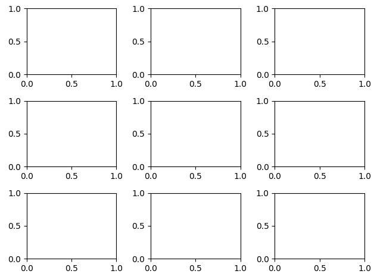
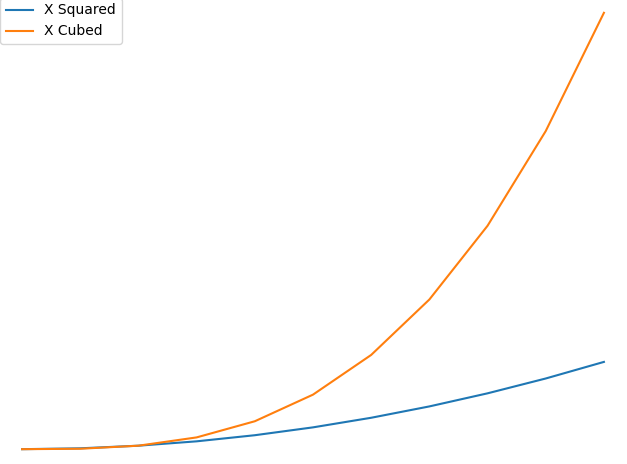

# pythonWithMatplotlib

## Matplotlib
- Functional methods for creating a simple x-axis and y-axis graph.

- Simple creation of multiple plot on the same canvas. 

- Application of OOP concept on creation of nested graph.

- Creation of canvas with multiple plots with the use of OOP.

- Addition of Legends in plot.
